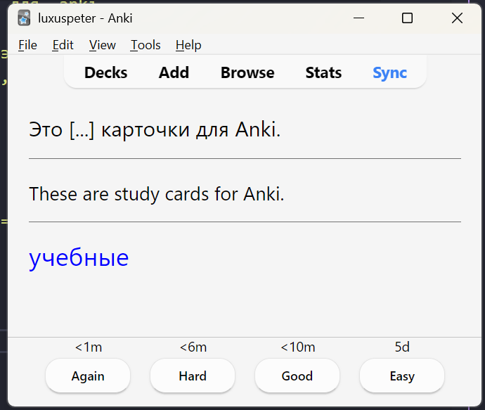

# Anki Decks Tools
A collection of python scripts for generating Anki Decks.

## ankiDecksMaker.py
This script generates a Anki Deck from a text file, Russian to English. Use **multiLanguageDecksMaker.py** instead if you want to learn a different language.
It reads every phrase and new words are inserted as new cards.
Then also the other way around.
Finally a guess card for the word with the phrase.

It repeats that for every phrase and only new words are inserted.

### How to use
Install dependencies first.

```shell
pip install genanki deep-translator nltk
```

Insert your text inside russian_text.txt. Then just run it with

```shell
python ankiDecksMaker.py
```

The output looks like this:
```shell
PS C:\WORK\GITHUB\AnkiDeckTools> python.exe .\ankiDecksMaker.py
Reading text file...
Tokenizing sentences...
Found 3 sentences

Processing sentence 1/3: Это учебные карточки для Anki....
  Found 5 new word(s): это, учебные, карточки, для, anki

Processing sentence 2/3: Вы можете вставить в этот текстовый файл свой собс...
  Found 12 new word(s): можете, вставить, этот, текстовый, файл, свой, собственный, текст, затем, можно, приступать, обучению

Processing sentence 3/3: Удачи!...
  Found 1 new word(s): удачи

==================================================
Saving deck to russian_deck.apkg...
Done! Deck created successfully.
Total unique words: 18
Total cards created: 54
```



